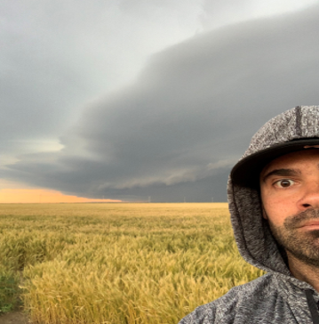

<style>
p.comment {
background-color: #DBDBDB;
padding: 10px;
border: 1px solid black;
margin-left: 25px;
border-radius: 5px;
font-style: italic;
}

.figure {
   margin-top: 20px;
   margin-bottom: 20px;
}

h1.title {
  font-weight: bold;
  font-family: Arial;  
}

h2.title {
  font-family: Arial;  
}

</style>


<style type="text/css">
#TOC {
  font-size: 13px;
  font-family: Arial;
}
</style>


\


This website is a complimentary data source for my Masters of Geographic Information Systems Capstone Project through Penn State's World Campus. 

```{r}

```


On this website you will find information pertaining to diurnal tornado patterns and their human impact:

* Background on Tornadoes
* Human Impact of Tornadoes 
* Tornado Warning System
* Diurnal Tornadoes
* Objectives
* Methods
* Results


<br>

## Giving Credit

The following websites were used in the construction of this course website. My gratitude to the people who invested their time and effort in developing and offering these valuable resources to the public.

* Noli Brazil's wonderful lab website design for his course on [Quantitative Methods in Community Research](https://crd150.github.io/index.html)


***
<a rel="license" href="http://creativecommons.org/licenses/by-nc/4.0/"></a><br />This work is licensed under a <a rel="license" href="http://creativecommons.org/licenses/by-nc/4.0/">Creative Commons Attribution-NonCommercial 4.0 International License</a>.


Website created and maintained by Frank DiCicco. Website template by [Noli Brazil](https://nbrazil.faculty.ucdavis.edu/)