<style>
p.comment {
background-color: #DBDBDB;
padding: 10px;
border: 1px solid black;
margin-left: 25px;
border-radius: 5px;
font-style: normal;
}

h1.title {
  font-weight: bold;
  font-family: Arial;  
}

h2.title {
  font-family: Arial;  
}

</style>


<style type="text/css">
#TOC {
  font-size: 13px;
  font-family: Arial;
}
</style>


\


```r
# load library
# if a library doesn't exist, then to download, go to the packages menu (next to help) and click install

# Upon downloading the .rmd file, I attempted to run this first code chunk and found that many of the libraries weren't installed.
#I needed to install each library before downloading it via this code

rm(list=ls())
library(sp)
library(sf)
library(raster)
library(tidycensus)
library(tidyverse)
library(plotly)
library(olsrr)
library(tmap)
library(RColorBrewer)
library("lubridate")
library(dplyr)
library(tmap)
```


```r
# dot . means current folder - and you don't need a file extension

# this code chunk uses "st_read" to read in the features from the initial tornado point shapefile
# the table/spreadsheet of data is saved to a variable "T_data"
T_data <- st_read(dsn="./1950-2019-torn-initpoint",
                  layer="1950-2019-torn-initpoint")
```

```
## Reading layer `1950-2019-torn-initpoint' from data source 
##   `C:\Users\Gift\Desktop\GEOG596A\Tornado_Website\1950-2019-torn-initpoint' 
##   using driver `ESRI Shapefile'
## Simple feature collection with 65162 features and 22 fields
## Geometry type: POINT
## Dimension:     XY
## Bounding box:  xmin: -163.53 ymin: 17.7212 xmax: -64.7151 ymax: 61.02
## Geodetic CRS:  WGS 84
```

```r
# make the date
# set the values in the date column to the variable "T_data$date"
# as.Date command converts the character data in the column to represent calendar dates
# calendar date is in the format year, month, date

T_data$date <- as.Date(T_data$date, format="%Y-%m-%d")
```


```r
# Let's cheat
head(T_data$time)
```

```
## [1] "11:00:00" "11:55:00" "16:00:00" "05:25:00" "19:30:00" "21:00:00"
```

```r
# strsplit splits each character time string into a "list" (advent calendar) of the hour, minutes and seconds for each row 
Fulltimes <- strsplit(T_data$time,":")


# Now we use the lapply function to make a new list with just the first one
# and we turn it back into just a normal row of numbers
T_data$hours   <-as.numeric(unlist(lapply(Fulltimes, "[",1)))
T_data$minutes <-as.numeric(unlist(lapply(Fulltimes, "[",2)))
T_data$seconds <-as.numeric(unlist(lapply(Fulltimes, "[",3)))
T_data$DecimalHour <- T_data$hours + (T_data$minutes/60)
```

```r
# This is the number of tornados at each magnitude and each hour
table(T_data$hour,T_data$mag)
```

```
##     
##        -9    0    1    2    3    4    5
##   0     1  283  412  211   39    7    0
##   1     1  236  400  171   34    8    0
##   2     2  209  322  167   43    2    0
##   3     0  201  281  159   36    4    0
##   4     0  214  299  132   31    3    0
##   5     1  206  314  142   25    4    0
##   6     3  245  287  140   30    4    0
##   7     0  309  321  133   22    2    0
##   8     0  375  311  113   32    1    0
##   9     2  446  386  152   28    3    0
##   10    4  570  444  129   38    5    0
##   11    3  828  567  209   61    9    0
##   12    7 1288  811  321   56   15    0
##   13   17 1778 1206  432  111   18    5
##   14   35 2407 1653  594  161   46    9
##   15   40 3200 2073  829  219   72   10
##   16   46 3751 2315  964  250   66    8
##   17   28 3858 2387 1030  315   91   11
##   18   49 3460 2113  990  290   82    7
##   19   28 2732 1743  746  249   49    4
##   20   16 1646 1258  574  181   34    2
##   21    7 1021  864  426  125   21    1
##   22    6  645  668  326   60   13    1
##   23    2  450  618  235   61   13    1
```

```r
# mag < 0 has been set to missing
T_data$mag[T_data$mag < 0 ] <- NA
```


```r
# Bin size control + color palette
ggplot(T_data, aes(x=DecimalHour, y=mag) ) +
  geom_bin2d(bins = 70) +
  scale_fill_continuous(type = "viridis") +
  theme_bw()
```

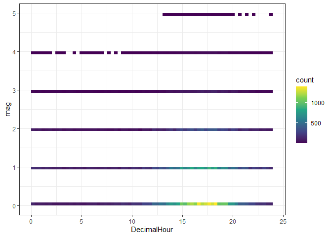<!-- -->

```r
# Bin size control + color palette
ggplot(T_data, aes(x=DecimalHour, y=fat) ) +
  geom_bin2d(bins = 70) +
  scale_fill_continuous(type = "viridis") +
  theme_bw()
```

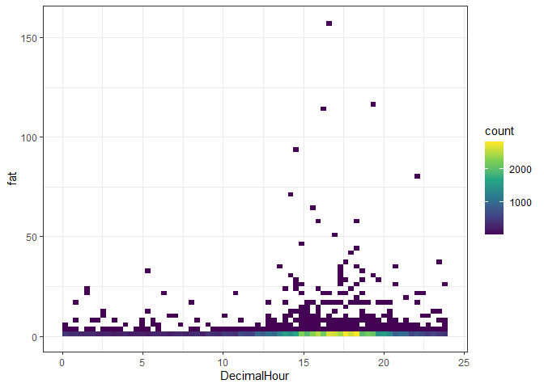<!-- -->


```r
TimeOfDay <- split(T_data,as.factor(T_data$hours))

TimeOfDaySummary <- data.frame(TimeOfDay        = sapply(split(T_data$hours,as.factor(T_data$hours)),"[",1),
                               NumberOfTornados = sapply(TimeOfDay,nrow),
                               TotalFatalities  = sapply(split(T_data$fat,as.factor(T_data$hours)),sum,na.rm=TRUE),
                               AvFatalities     = sapply(split(T_data$fat,as.factor(T_data$hours)),mean,na.rm=TRUE),
                               AvMag            = sapply(split(T_data$mag,as.factor(T_data$hours)),mean,na.rm=TRUE))

## In words, make a wish list of what you would like to see by hour

TimeOfDaySummary
```

```
##    TimeOfDay NumberOfTornados TotalFatalities AvFatalities     AvMag
## 0          0              953              60   0.06295908 1.0283613
## 1          1              850             132   0.15529412 1.0318021
## 2          2              745              84   0.11275168 1.0672948
## 3          3              681              67   0.09838473 1.0616740
## 4          4              679              44   0.06480118 0.9837997
## 5          5              692              87   0.12572254 0.9971056
## 6          6              709              56   0.07898449 0.9532578
## 7          7              787              28   0.03557814 0.8398983
## 8          8              832              40   0.04807692 0.7656250
## 9          9             1017              20   0.01966568 0.7743842
## 10        10             1190              74   0.06218487 0.7048904
## 11        11             1677              48   0.02862254 0.7192354
## 12        12             2498              85   0.03402722 0.6748294
## 13        13             3567             233   0.06532100 0.7042254
## 14        14             4905             605   0.12334353 0.7295688
## 15        15             6443             558   0.08660562 0.7380915
## 16        16             7400             849   0.11472973 0.7202883
## 17        17             7720             682   0.08834197 0.7554602
## 18        18             6991             750   0.10728079 0.7672141
## 19        19             5551             479   0.08629076 0.7600942
## 20        20             3711             303   0.08164915 0.8376184
## 21        21             2465             191   0.07748479 0.8868999
## 22        22             1719             274   0.15939500 0.9089317
## 23        23             1380             183   0.13260870 0.9637155
```

```r
#split by year
ByYear <- split(T_data,as.factor(T_data$yr))

ByYearSummary <- data.frame(Year        = sapply(split(T_data$yr,as.factor(T_data$yr)),"[",1),
                               NumberOfTornados = sapply(ByYear,nrow),
                               TotalFatalities  = sapply(split(T_data$fat,as.factor(T_data$yr)),sum,na.rm=TRUE),
                               AvFatalities     = sapply(split(T_data$fat,as.factor(T_data$yr)),mean,na.rm=TRUE),
                               AvMag            = sapply(split(T_data$mag,as.factor(T_data$yr)),mean,na.rm=TRUE))

## In words, make a wish list of what you would like to see by hour

ByYearSummary
```

```
##      Year NumberOfTornados TotalFatalities AvFatalities     AvMag
## 1950 1950              201              70  0.348258706 1.6019900
## 1951 1951              260              34  0.130769231 1.3653846
## 1952 1952              240             230  0.958333333 1.6916667
## 1953 1953              421             523  1.242280285 1.5201900
## 1954 1954              550              36  0.065454545 1.3618182
## 1955 1955              591             129  0.218274112 1.1455161
## 1956 1956              504              81  0.160714286 1.2738095
## 1957 1957              858             192  0.223776224 1.2902098
## 1958 1958              564              67  0.118794326 1.1560284
## 1959 1959              604              58  0.096026490 1.1672185
## 1960 1960              616              46  0.074675325 1.2548701
## 1961 1961              697              52  0.074605452 1.3271162
## 1962 1962              657              30  0.045662100 1.0837139
## 1963 1963              463              31  0.066954644 1.2829374
## 1964 1964              704              73  0.103693182 1.2315341
## 1965 1965              897             301  0.335562988 1.2664437
## 1966 1966              585              98  0.167521368 1.0854701
## 1967 1967              927             114  0.122977346 1.1380798
## 1968 1968              657             131  0.199391172 1.1354642
## 1969 1969              608              66  0.108552632 1.1036184
## 1970 1970              653              73  0.111791730 1.1944870
## 1971 1971              889             159  0.178852643 1.2553431
## 1972 1972              741              27  0.036437247 1.1255061
## 1973 1973             1102              89  0.080762250 1.2422868
## 1974 1974              945             366  0.387301587 1.3079365
## 1975 1975              919              60  0.065288357 0.9836779
## 1976 1976              834              44  0.052757794 1.0887290
## 1977 1977              852              43  0.050469484 1.0387324
## 1978 1978              789              53  0.067173638 0.7984791
## 1979 1979              855              84  0.098245614 0.8128655
## 1980 1980              866              28  0.032332564 0.9699769
## 1981 1981              782              24  0.030690537 0.9143223
## 1982 1982             1047              64  0.061127030 0.9531996
## 1983 1983              930              34  0.036559140 0.9172043
## 1984 1984              907             122  0.134509372 0.8687982
## 1985 1985              684              94  0.137426901 0.7909357
## 1986 1986              765              15  0.019607843 0.7555556
## 1987 1987              656              59  0.089939024 0.6265244
## 1988 1988              702              32  0.045584046 0.7934473
## 1989 1989              856              50  0.058411215 0.7500000
## 1990 1990             1133              53  0.046778464 0.7775816
## 1991 1991             1132              39  0.034452297 0.5715548
## 1992 1992             1297              39  0.030069391 0.6607556
## 1993 1993             1172              33  0.028156997 0.5093857
## 1994 1994             1082              69  0.063770795 0.5027726
## 1995 1995             1237              30  0.024252223 0.4761520
## 1996 1996             1173              26  0.022165388 0.4893436
## 1997 1997             1148              68  0.059233449 0.5043554
## 1998 1998             1424             130  0.091292135 0.5287921
## 1999 1999             1339              94  0.070201643 0.5772965
## 2000 2000             1075              41  0.038139535 0.4306977
## 2001 2001             1215              40  0.032921811 0.4666667
## 2002 2002              934              55  0.058886510 0.4743041
## 2003 2003             1374              54  0.039301310 0.4759825
## 2004 2004             1817              35  0.019262521 0.4210237
## 2005 2005             1263              38  0.030087094 0.4552652
## 2006 2006             1103              67  0.060743427 0.5222121
## 2007 2007             1095              81  0.073972603 0.5324201
## 2008 2008             1689             126  0.074600355 0.5837774
## 2009 2009             1156              22  0.019031142 0.5043253
## 2010 2010             1281              45  0.035128806 0.5768931
## 2011 2011             1691             553  0.327025429 0.7616795
## 2012 2012              938              69  0.073560768 0.5511727
## 2013 2013              906              55  0.060706402 0.6070640
## 2014 2014              886              47  0.053047404 0.6106095
## 2015 2015             1177              36  0.030586236 0.5012744
## 2016 2016              976              18  0.018442623 0.5813953
## 2017 2017             1428              35  0.024509804 0.6561584
## 2018 2018             1126              10  0.008880995 0.5347160
## 2019 2019             1517              42  0.027686223 0.6586466
```


```r
plot(ByYearSummary$Year,
     ByYearSummary$TotalFatalities,type="h")
```

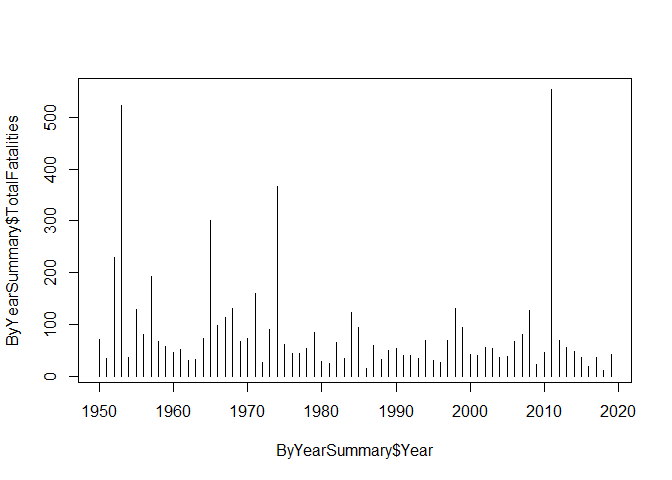<!-- -->

```r
# The ~ means "is a function of" e.g. y variable goes first

plot(TimeOfDaySummary$AvFatalities ~  TimeOfDaySummary$TimeOfDay,
     ylab="Average number of fatalities in that hour slot",
     xlab="Time of day",
     type="o")
```

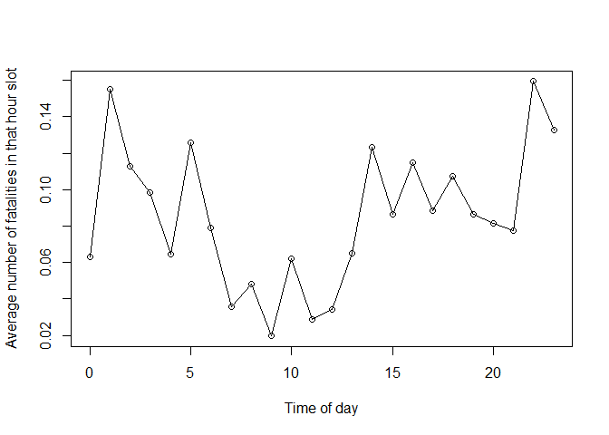<!-- -->

```r
#  YOU CHOOSE THE MAGNITUDE HERE

magnitude <- 1

# filter that mag
T_data_Mag <- filter(T_data,mag==magnitude)

# Split the data
TimeOfDay_Mag <- split(T_data_Mag,as.factor(T_data_Mag$hours))

# split by time of day as a summary table
TimeOfDaySummary_Mag <- data.frame(TimeOfDay   = sapply(split(T_data_Mag$hours,as.factor(T_data_Mag$hours)),"[",1),
                               NumberOfTornados = sapply(TimeOfDay_Mag,nrow),
                               TotalFatalities  = sapply(split(T_data_Mag$fat,as.factor(T_data_Mag$hours)),sum,na.rm=TRUE),
                               AvFatalities     = sapply(split(T_data_Mag$fat,as.factor(T_data_Mag$hours)),mean,na.rm=TRUE),
                               AvMag            = sapply(split(T_data_Mag$mag,as.factor(T_data_Mag$hours)),mean,na.rm=TRUE))


plot(TimeOfDaySummary_Mag$TotalFatalities ~  TimeOfDaySummary_Mag$TimeOfDay,
     ylab=paste("Total fatalities at Mag",magnitude),type="o")
```

<!-- -->

```r
plot(TimeOfDaySummary_Mag$AvFatalities ~  TimeOfDaySummary_Mag$TimeOfDay,
     ylab=paste("Average fatalities at Mag",magnitude),type="o")
```

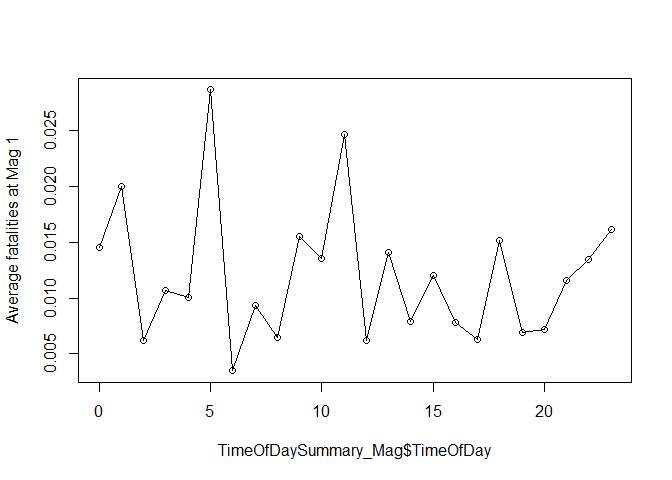<!-- -->

```r
#  YOU CHOOSE THE MAGNITUDE HERE

magnitude <- 2

# filter that mag
T_data_Mag <- filter(T_data,mag==magnitude)

# Split the data
TimeOfDay_Mag <- split(T_data_Mag,as.factor(T_data_Mag$hours))

# split by time of day as a summary table
TimeOfDaySummary_Mag <- data.frame(TimeOfDay   = sapply(split(T_data_Mag$hours,as.factor(T_data_Mag$hours)),"[",1),
                               NumberOfTornados = sapply(TimeOfDay_Mag,nrow),
                               TotalFatalities  = sapply(split(T_data_Mag$fat,as.factor(T_data_Mag$hours)),sum,na.rm=TRUE),
                               AvFatalities     = sapply(split(T_data_Mag$fat,as.factor(T_data_Mag$hours)),mean,na.rm=TRUE),
                               AvMag            = sapply(split(T_data_Mag$mag,as.factor(T_data_Mag$hours)),mean,na.rm=TRUE))


plot(TimeOfDaySummary_Mag$TotalFatalities ~  TimeOfDaySummary_Mag$TimeOfDay,
     ylab=paste("Total fatalities at Mag",magnitude),type="o")
```

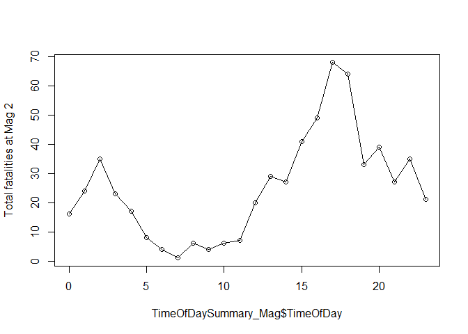<!-- -->

```r
plot(TimeOfDaySummary_Mag$AvFatalities ~  TimeOfDaySummary_Mag$TimeOfDay,
     ylab=paste("Average fatalities at Mag",magnitude),type="o")
```

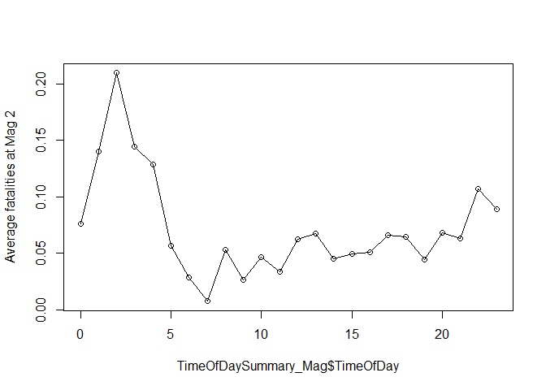<!-- -->


```r
#  YOU CHOOSE THE MAGNITUDE HERE

magnitude <- 3

# filter that mag
T_data_Mag <- filter(T_data,mag==magnitude)

# Split the data
TimeOfDay_Mag <- split(T_data_Mag,as.factor(T_data_Mag$hours))

# split by time of day as a summary table
TimeOfDaySummary_Mag <- data.frame(TimeOfDay   = sapply(split(T_data_Mag$hours,as.factor(T_data_Mag$hours)),"[",1),
                               NumberOfTornados = sapply(TimeOfDay_Mag,nrow),
                               TotalFatalities  = sapply(split(T_data_Mag$fat,as.factor(T_data_Mag$hours)),sum,na.rm=TRUE),
                               AvFatalities     = sapply(split(T_data_Mag$fat,as.factor(T_data_Mag$hours)),mean,na.rm=TRUE),
                               AvMag            = sapply(split(T_data_Mag$mag,as.factor(T_data_Mag$hours)),mean,na.rm=TRUE))


plot(TimeOfDaySummary_Mag$TotalFatalities ~  TimeOfDaySummary_Mag$TimeOfDay,
     ylab=paste("Total fatalities at Mag",magnitude),type="o")
```

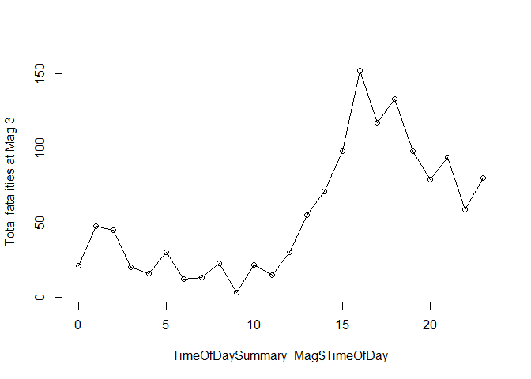<!-- -->

```r
plot(TimeOfDaySummary_Mag$AvFatalities ~  TimeOfDaySummary_Mag$TimeOfDay,
     ylab=paste("Average fatalities at Mag",magnitude),type="o")
```

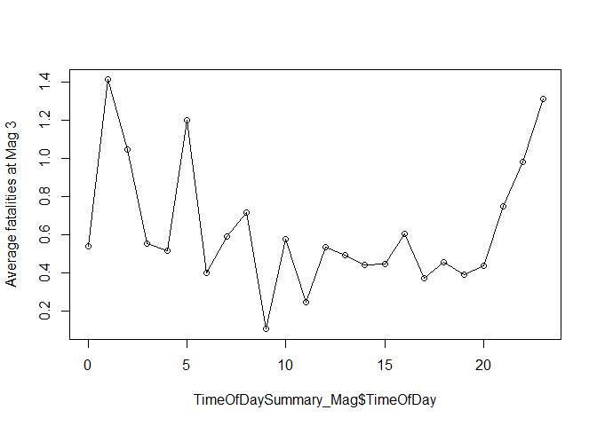<!-- -->


```r
#  YOU CHOOSE THE MAGNITUDE HERE

magnitude <- 4

# filter that mag
T_data_Mag <- filter(T_data,mag==magnitude)

# Split the data
TimeOfDay_Mag <- split(T_data_Mag,as.factor(T_data_Mag$hours))

# split by time of day as a summary table
TimeOfDaySummary_Mag <- data.frame(TimeOfDay   = sapply(split(T_data_Mag$hours,as.factor(T_data_Mag$hours)),"[",1),
                               NumberOfTornados = sapply(TimeOfDay_Mag,nrow),
                               TotalFatalities  = sapply(split(T_data_Mag$fat,as.factor(T_data_Mag$hours)),sum,na.rm=TRUE),
                               AvFatalities     = sapply(split(T_data_Mag$fat,as.factor(T_data_Mag$hours)),mean,na.rm=TRUE),
                               AvMag            = sapply(split(T_data_Mag$mag,as.factor(T_data_Mag$hours)),mean,na.rm=TRUE))


plot(TimeOfDaySummary_Mag$TotalFatalities ~  TimeOfDaySummary_Mag$TimeOfDay,
     ylab=paste("Total fatalities at Mag",magnitude),type="o")
```

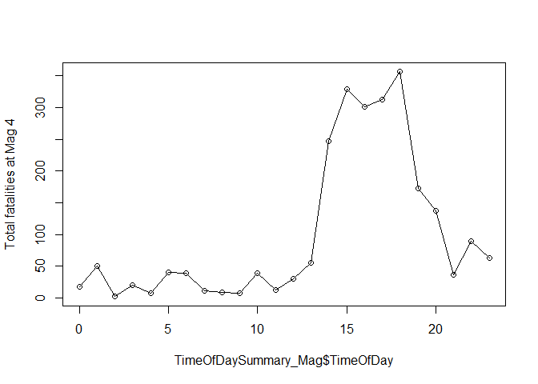<!-- -->

```r
plot(TimeOfDaySummary_Mag$AvFatalities ~  TimeOfDaySummary_Mag$TimeOfDay,
     ylab=paste("Average fatalities at Mag",magnitude),type="o")
```

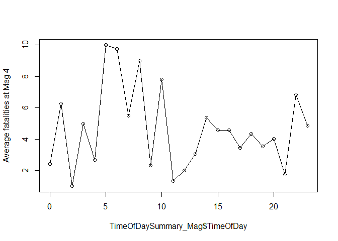<!-- -->


```r
#  YOU CHOOSE THE MAGNITUDE HERE

magnitude <- 5

# filter that mag
T_data_Mag <- filter(T_data,mag==magnitude)

# Split the data
TimeOfDay_Mag <- split(T_data_Mag,as.factor(T_data_Mag$hours))

# split by time of day as a summary table
TimeOfDaySummary_Mag <- data.frame(TimeOfDay   = sapply(split(T_data_Mag$hours,as.factor(T_data_Mag$hours)),"[",1),
                               NumberOfTornados = sapply(TimeOfDay_Mag,nrow),
                               TotalFatalities  = sapply(split(T_data_Mag$fat,as.factor(T_data_Mag$hours)),sum,na.rm=TRUE),
                               AvFatalities     = sapply(split(T_data_Mag$fat,as.factor(T_data_Mag$hours)),mean,na.rm=TRUE),
                               AvMag            = sapply(split(T_data_Mag$mag,as.factor(T_data_Mag$hours)),mean,na.rm=TRUE))


plot(TimeOfDaySummary_Mag$TotalFatalities ~  TimeOfDaySummary_Mag$TimeOfDay,
     ylab=paste("Total fatalities at Mag",magnitude),type="o")
```

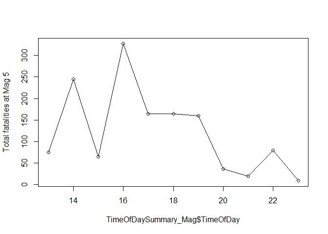<!-- -->

```r
plot(TimeOfDaySummary_Mag$AvFatalities ~  TimeOfDaySummary_Mag$TimeOfDay,
     ylab=paste("Average fatalities at Mag",magnitude),type="o")
```

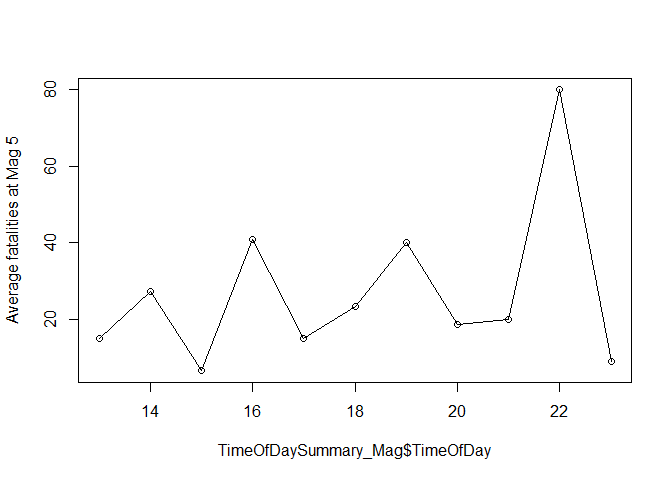<!-- -->


Your text goes here


***

<a rel="license" href="http://creativecommons.org/licenses/by-nc/4.0/"></a><br />This work is licensed under a <a rel="license" href="http://creativecommons.org/licenses/by-nc/4.0/">Creative Commons Attribution-NonCommercial 4.0 International License</a>.


Website created and maintained by [Helen Greatrex](https://www.geog.psu.edu/directory/helen-greatrex). Website template by [Noli Brazil](https://nbrazil.faculty.ucdavis.edu/)
