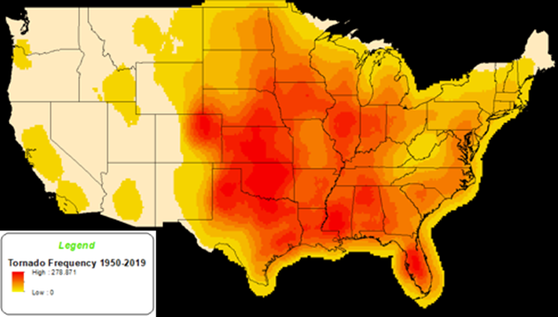

<style>
p.comment {
background-color: #DBDBDB;
padding: 10px;
border: 1px solid black;
margin-left: 25px;
border-radius: 5px;
font-style: italic;
}

.figure {
   margin-top: 20px;
   margin-bottom: 20px;
}

h1.title {
  font-weight: bold;
  font-family: Arial;  
}

h2.title {
  font-family: Arial;  
}

</style>


<style type="text/css">
#TOC {
  font-size: 13px;
  font-family: Arial;
}
</style>

\

Tornadoes are one of the most destructive forms of severe weather in the United States.  While tornadoes occur in every country in the world, the United States is uniquely positioned where warm, moist and cold, dry air masses collide during the spring and early summer months, also known as “Tornado Season”.  This collision of air masses typically occurs in what is known as “Tornado Alley”, comprising most of the Great Plains region and some areas of the surrounding states (Figure 1).  Tornadoes also occur with higher frequency along the Gulf Coast and in Florida, primarily due to formation within tropical cyclones.  On average, the US experiences about 1,000 tornadoes per year, over 900 more than the next closest country (NOAA, 2020).  Tornado intensity and strength are based on a survey of damage caused by a tornado.  The damage is then compared to a list of indicators and assigned an estimated wind speed.  The wind speed is then designated a rating based on the Enhanced Fujita (EF) Scale (Figure 2).   The EF Scale replaced the Fujita scale in 2007 so to better estimate wind speeds aligned with the damage caused by a tornado.  The EF Scale rating begins with EF0 or tornadoes with 65-85mph wind gusts and light damage, through EF5 tornadoes with wind gusts over 200mph and incredible damage.

```{r}

```

Figure 1. Annual Tornado Heat Map.

```{r}
knitr::include_graphics('EF_Scale.png')
```

Figure 2. Enhanced Fujita Scale.

Citation [National Weather Service](https://www.weather.gov/oun/efscale)

***


<a rel="license" href="http://creativecommons.org/licenses/by-nc/4.0/"></a><br />This work is licensed under a <a rel="license" href="http://creativecommons.org/licenses/by-nc/4.0/">Creative Commons Attribution-NonCommercial 4.0 International License</a>.


Website created and maintained by [Helen Greatrex](https://www.geog.psu.edu/directory/helen-greatrex). Website template by [Noli Brazil](https://nbrazil.faculty.ucdavis.edu/)