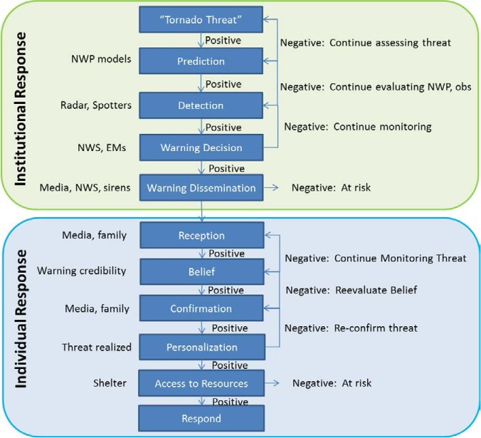

\

# What are they & how have they changed? What is the current state of affairs?

## some text

### more text

#### and some more

In recent decades, the impact of tornadoes has been mitigated by the development and improvements in a robust severe weather warning system, run federally by the National Weather Service.   The origins of this system span back to March of 1948, where America’s first tornado warning was issued by two Air Force officers in Oklahoma City (Brotzge and Donner, 2013).  The success of this effort led to the formation of the first national severe weather warning program.  A tornado warning, as opposed to a tornado watch, is issued based on the detection of, either through spotting networks or radar indication, an imminent tornado threat.  Figure 3 depicts the sequence of events for both the NWS and expected individual action during which a tornado is warned.

 

Hello

Figure 3.  Tornado Warning Process (Figure obtained from: Brotzge & Donner 2013)
Citation: [Bulletin of the American Meteorological Society 94, 11](https://journals.ametsoc.org/view/journals/bams/94/11/bams-d-12-00147.1.xml)

Currently, the National Weather Service is responsible for issuing tornado warnings and have iteratively improved warning accuracy. Until 2017 tornado warnings were issued by county, but have since been replaced by smaller, more accurate storm based warnings.  A tornado warning polygon covers a geographical area determined to be most at risk from a potential storm.  This polygon has a start and end time associated with the highest tornado threat.  Brotzge & Donner found that tornado related deaths were reduced from 260 on average per year between 1912 and 1936, to 54 on average per year between 1975 and 2000.  In addition, warning times for tornadoes drastically increased from roughly 5 minutes in 1986, to an average of 13 minutes in 2004 (Erickson & Brooks, 2006).  While the warning system and reactive measures by the public have improved, tornado related fatalities are still significant in the United States and further enhancement can be made.

How do we know if the warnings are any good?

What statistics are used for measuring accuracy?

Before moving further, it is important to address the concept of tornado forecast accuracy.  There are many potential statistics and measures to capture how “accurate” the tornado warning system is.  One important family of such statistics are dichotomous forecasts.  In regards to tornadoes, a dichotomous forecast determines if a tornado was verified to have been on the ground or not.  Several statistics have been found to be especially important for tornado forecasts. The false alarm rate (FAR) is a metric used to determine the number of forecasted weather events that did not occur.  As of 2003, the FAR for tornado warnings was 0.76, or roughly 1 in 4 warnings were associated with a tornado touching down (Barnes et al., 2007).  FAR is much higher for tornadoes than other severe weather events, indicating the difficulty in predicting when and where a tornado will occur.  However, the reduction in FAR between 1986 and 2004 resulted in a marked decrease in expected injuries and fatalities due to tornadoes (Simmons and Sutter, 2009).

The National Weather Service uses two metrics to determine tornado warning performance, probability of detection (POD) and FAR.  In theory, it is possible to increase POD by issuing a tornado warning for every storm.  However, this would significantly decrease FAR, leading to a potential, “cry-wolf” effect.  There is however little evidence to suggest that such a false alarm effect exists.  Conversely, FAR could be increased by only issuing warnings when tornadoes have been reported on the ground.  In terms of assessing tornados through this lens, Simmons and Sutter discuss the impact of false alarm tornado warnings on casualties, finding strong evidence supporting a higher FAR increases casualties and injuries associated with tornadoes.  Thus, they conclude that FAR is a valuable performance metric for the NWS.  However, maximizing POD is not recommended with the known trade off of decreasing FAR.  These statistics depict the difficulty in warning the public of a potential tornado threat with diminishing the trust in the warning itself.  It is essential for public safety to determine the best way to warn the public of tornadoes while ensuring the accuracy of such warnings is within an acceptable range.

Spatio temporal aspects of warning accuracy

Additionally tornado warnings need to be geographically accurate.  While some geographic analysis has been conducted on regional levels, specifically in two tornado events in Alabama (Cannon et al., 2012), there appears to be no large scale analysis of tornado warning accuracy.  They attempted to visualize, using GIS, if tornado warnings became more effective over time.  Two tornado outbreaks were used in the study, both located in Alabama.  Both tornado events occurred in April, 1974 and 2011 respectively.  The results determined that due to improvements in the tornado warning system, the rate of death by exposure decreased between the 1974 and 2011 outbreaks.  However, it should be noted that more fatalities were recorded in the 2011 event, but when considering population impacted by the outbreak, the percentages decreased.  While this study focused on Alabama, there was little evidence of larger scale studies on tornado warnings and their geographic accuracy. 

How do people respond to warnings?

However, even if tornado warning accuracy were a perfect science, there are many factors that influence a person’s response to the warning. Ripberger et al. (2020) analyzed if different communities displayed similar comprehension, reception and response to tornado warnings.  Using large population surveys dealing with risk factors, they found differences in comparable communities in regards to public perception and response to severe weather warnings.  For an effective warning system, understanding the social science behind response to a warning is just as important as tornado meteorology. 

In their 2018 paper,  Jon, Huang and Lindell examine if National Weather Service tornado warning polygons are too imprecise, leading to ambivalence of perceived danger. They used a survey approach of 145 participants shown 22 hypothetical scenarios to assess perceived risk at varying locations in tornado warning polygons.  The study concluded that people perceive the highest risk to be associated with the centroid of a warning polygon.  However, the authors note that this does not align with the National Weather Service intentions.  Furthermore the paper also determined that alterations such as gradient polygons do not increase the likelihood of protective action as the respondent still perceives risk to be highest near the center of the warning polygon.  

Further studies conducted by Ripberger et al. (2015) analysed the advances in tornado warnings and why people respond differently to similar warnings in the same region.  This study was conducted through two large population surveys that found respondents were more likely to take protective action during a warned storm if the consequences of the event were disseminated in the warning.  However, the research also found that the type of protective action taken by the respondents could potentially lead to higher risk of injury or death i.e. leaving home to seek shelter versus sheltering in place.  

More specifically, Kuligowski (2011) used surveys of the Joplin tornado survivors to determine the factors that influenced their decision to take protective action during the tornado event.  Through the surveys, it was found that most residents did not seek shelter due to the lack of physical queues of the approaching storms, recent false alarms, inadequate and/or confusing emergency communication and the perceived knowledge of Joplin’s “tornado geography”.  Of note, Joplin had many tornado false alarms in the decade prior to the 2011 storm, but near the national average.  Additionally, tornado sirens were tested on a weekly basis, which could have led to desensitization to the alarms.  Based on this study a conceptual decision making model was developed to help understand decision making and sheltering factors.  It is important to understand how improvement to tornado warning polygons could influence protective action and potentially save lives.   

***

 This work is licensed under a <a rel="license" href="http://creativecommons.org/licenses/by-nc/4.0/">Creative Commons Attribution-NonCommercial 4.0 International License</a>.

Website created and maintained by [Helen Greatrex](https://www.geog.psu.edu/directory/helen-greatrex)
Website template by [Noli Brazil](https://nbrazil.faculty.ucdavis.edu/)
